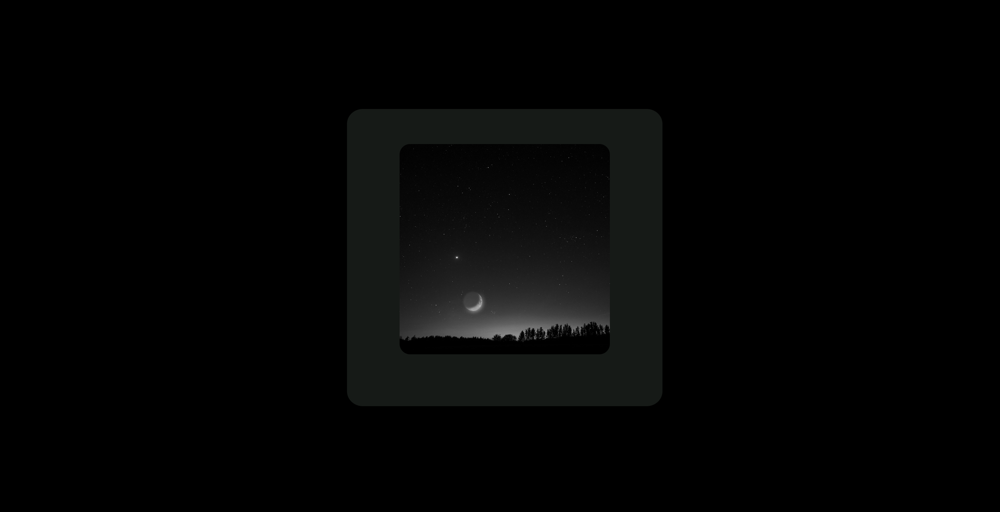
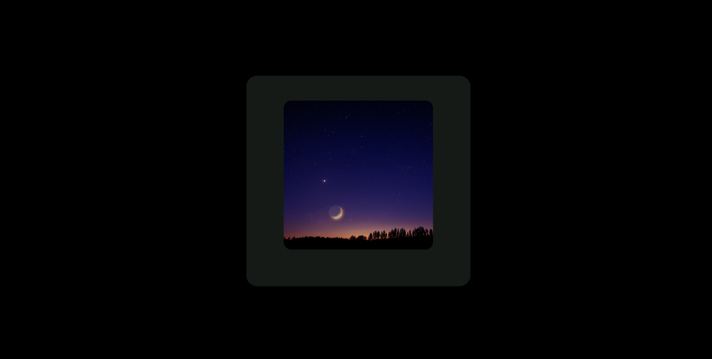

# 🎨 Image Grayscale

A simple web project to display and interact with grayscale images using **HTML** and **CSS**.  
Hover over the image to restore its original vibrant colors!

---

## 🚀 Features

- 🖼️ Display images in grayscale.
- 🎯 Hover to reveal original color.
- ⚡ Built only with **HTML** and **CSS**
- 📱 Fully responsive and clean design.

---

## 📸 Screenshot

| Grayscale Image | Color on Hover |
|:---------------:|:--------------:|
|  |  |


---

## 📂 Project Structure
```
/image-grayscale
  ├── index.html
  └── style.css
  └── color.png
  └── grayscale.png
       
